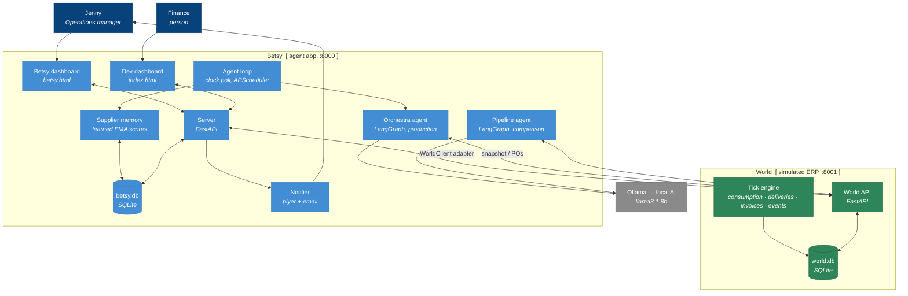

# Betsy — Autonomous Procurement Agent

Betsy is an AI agent that runs the procurement lifecycle of a small manufacturer autonomously: she watches inventory drain day by day, orders from the supplier she trusts most, tracks deliveries, audits incoming invoices, and learns from every outcome. Built as a school research project exploring what it takes to make an AI system that a non-technical operations manager can actually trust.

The project is split into **two services**:

- **The world** (`world/`, port 8001) — a standalone simulated ERP with its own database and a controllable clock. Each simulated day, stock is consumed, purchase orders progress toward delivery, suppliers issue invoices (sometimes wrong or duplicated), and prices drift. It knows each supplier's *true* reliability — but never tells anyone.
- **Betsy** (`server/`, port 8000) — the agent application: a multi-agent LangGraph "orchestra", an approvals workflow, desktop/email notifications, and a persistent memory of what she has *learned* about each supplier by observing deliveries. She talks to the world only through an API adapter (`shared/world_client.py`), so pointing her at a real ERP means re-implementing one module.

Full design rationale: [docs/WORLD_SIM_ARCHITECTURE.md](docs/WORLD_SIM_ARCHITECTURE.md).

---

## The lifecycle Betsy runs

As the world clock advances, Betsy's agent loop triggers automatically each sim day:

1. **Observe** — new deliveries update her learned supplier reliability scores (EMA)
2. **Detect** — three analyst agents run in parallel: inventory monitor, supplier scout, invoice auditor
3. **Decide** — an orchestrator resolves conflicting findings with code-level precedence + LLM tiebreaks
4. **Act** — small POs are placed autonomously; price spikes, duplicates, and anything above the $5,000 limit go to the human approval queue
5. **Learn** — the next delivery outcome feeds back into step 1

Scenario scripts (stockout, price spike, duplicate invoice, supplier outage) are **events injected into the running simulation**, not state resets — Betsy has to notice them among everything else happening.

---

## Stack

| Layer | Tech |
|---|---|
| Agent framework | LangGraph (Orchestra multi-agent; Pipeline kept as comparison) |
| LLM | Ollama — llama3.1:8b (local, rule-based fallbacks work offline) |
| Backend | FastAPI + uvicorn (two apps) |
| Persistence | SQLite — `world.db` (environment) + `betsy.db` (agent memory) |
| Scheduling | asyncio tick loop (world) + APScheduler poll (Betsy) |
| Frontend | Vanilla JS, no framework |

---

## Architecture at a glance

Who uses Betsy, and the parts inside it (a C4-style container view):



Plain-English design docs (with diagrams) live in `docs/` and `pdf_exports/design/`:
[gap-analysis](docs/gap-analysis.txt) (the before→after case for Betsy),
[pipeline-architecture](docs/pipeline-architecture.txt),
[orchestra-architecture](docs/orchestra-architecture.txt), and
[api-control-layer](docs/api-control-layer.txt). All diagrams are in `diagrams/`
(see [`diagrams/00-INDEX.txt`](diagrams/00-INDEX.txt)).

---

## Setup

**Prerequisites:** Python 3.11+, [Ollama](https://ollama.ai) running locally with `llama3.1:8b` pulled (optional — rule fallbacks cover everything offline).

```bash
# install dependencies
pip install -r requirements.txt

# start both services
python run_all.py

# ...or separately:
python run_world.py     # simulated ERP on :8001
python run_server.py    # Betsy on :8000
```

Open **http://localhost:8000/betsy**, press **▶ Play**, and watch the world run. **http://localhost:8000** is the raw dev dashboard; **http://localhost:8001/docs** is the world's API.

---

## Project structure

```
betsy-ai-agent/
├── world/                   Simulated ERP (standalone FastAPI service)
│   ├── engine.py            Tick engine: consumption, deliveries, invoices, events
│   ├── db.py                world.db schema, seeding, serializers
│   ├── runner.py            Background clock loop
│   ├── scenarios/           Event scripts (stockout, price spike, duplicate, outage)
│   └── routers/             inventory, suppliers, orders, invoices, clock, events, snapshot
├── server/                  Betsy app (FastAPI service)
│   ├── main.py              App entry, agent poll loop wiring
│   ├── agent_loop.py        Clock-driven trigger: observe → run orchestra
│   ├── memory.py            Learned supplier scores (EMA), persisted in betsy.db
│   ├── db.py                betsy.db: agent log, approvals, supplier memory
│   └── routers/             proxies to world + approvals, stats, sim controls, notifications
├── shared/
│   ├── world_client.py      The ERP adapter — the only door between Betsy and the world
│   └── llm.py               Ollama client with safe JSON parsing + fallbacks
├── orchestra/               Production agent: parallel multi-agent LangGraph
├── pipeline/                Linear predecessor, kept as DL-04 comparison artifact
├── dashboard/
│   ├── betsy.html           Agent UI — sim clock, event feed, approvals, learned scores
│   └── index.html           Dev dashboard — raw data view
├── mock_data/               Seed data: 12 SKUs, 6 suppliers, POs, invoices
├── tests/                   Offline pytest suite + live evidence scripts
├── docs/                    Architecture docs (incl. WORLD_SIM_ARCHITECTURE.md)
├── diagrams/                Design diagrams + wireframes (see diagrams/00-INDEX.txt)
└── decision_logs/           8 decision logs documenting every major build choice
```

---

## Learning: ground truth vs learned belief

The world assigns each supplier a hidden `true_reliability` that only drives delivery-date jitter — it is never exposed through the API. Betsy starts every supplier at a neutral 0.8 and updates her own score from observed outcomes:

```
performance = max(0.0, 1.0 − lateness_days × 0.1)
new_score   = 0.2 × performance + 0.8 × old_score
```

Scores live in `betsy.db`, survive restarts, and directly change who she orders from — a supplier who keeps delivering late gets dropped for a slower-but-reliable one. `tests/test_long_term_learning.py` demonstrates the flip end-to-end.

---

## Running tests

```bash
# offline unit + e2e suite (no services, no LLM needed)
pytest tests/test_world_engine.py tests/test_event_injection.py tests/test_ema_observer.py tests/test_e2e_sim.py tests/test_notifier.py

# live evidence scripts (start both services first)
python tests/test_ema_learning.py          # EMA math against a live delivery
python tests/test_long_term_learning.py    # learned ranking flips after bad deliveries
```

---

## Decision logs

Eight decision logs in `decision_logs/` document every major choice made during the build — framework selection, architecture tradeoffs, UI design rationale, the HITL approval flow, persistence strategy, the learning mechanism, and notifications. Each log follows the DOT framework research format used in the ICT bachelor programme.

| Log | What it covers |
|---|---|
| DL-01 | Building the mock environment |
| DL-02 | Pipeline vs Orchestra architecture |
| DL-03 | UI design for non-technical users |
| DL-04 | First real run and model selection |
| DL-05 | HITL approval queue end-to-end |
| DL-06 | SQLite persistence, EMA learning, APScheduler |
| DL-07 | Proving that score learning changes decisions |
| DL-08 | Desktop + email notifications |

The world/app split and simulation design are documented in [docs/WORLD_SIM_ARCHITECTURE.md](docs/WORLD_SIM_ARCHITECTURE.md).
