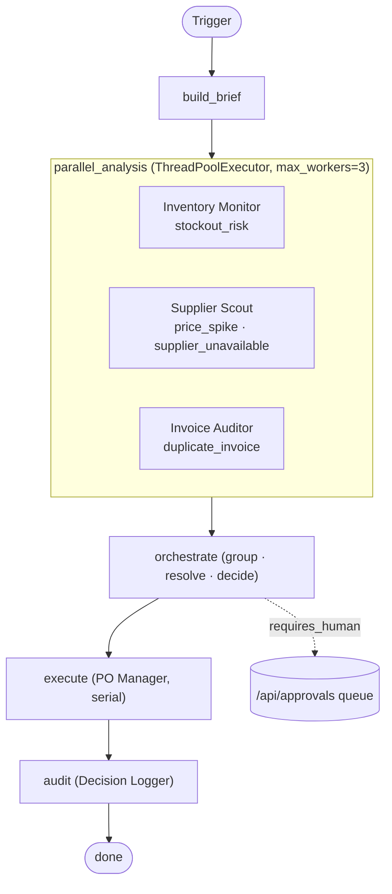
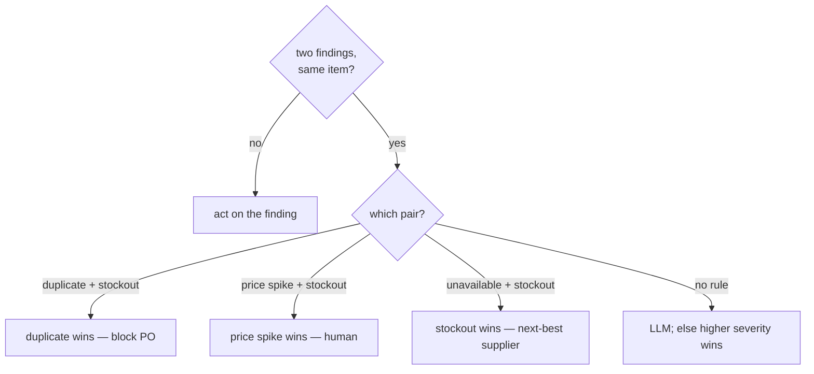

# Betsy — Orchestra Architecture

> **Parallel analysis · One coordinator · Explicit conflict rules**
> The orchestra is the second of Betsy's two agent designs. Three read-only
> specialists analyse the same data at once; a coordinator step then groups
> their findings, resolves any clashes with a fixed precedence table, and turns
> the winners into decisions. Like the pipeline, it is a **LangGraph
> `StateGraph`** — there is no separate "orchestrator" class and no message/schema
> dataclasses; everything is plain dicts carried in one shared state. Parallelism
> is a `ThreadPoolExecutor` used *inside* one node, not the top-level structure.

---

## Overview

A run moves through five nodes in a fixed order. The middle node fans out to
three specialists running concurrently, then the coordinator brings their
findings back together.



---

## Entry point — `orchestra/run.py`

`run.py` builds the compiled graph and invokes it with an empty initial state,
exactly like the pipeline. There is no `approval_mode` argument and no console
gate — human approval happens later through the `/api/approvals` queue. A run can
be started manually, or by the same server/scheduler that drives the pipeline.

---

## Shared state — `OrchestraState` (`orchestra/state.py`)

One `TypedDict` is threaded through all five nodes. It is a flat dictionary of
plain dicts and lists — there are **no** `SituationBrief`, `AgentTask`,
`Finding`, `AgentResult`, `ConflictReport`, or `OrchestraRun` classes (the old
doc invented those; they do not exist).

```
OrchestraState (TypedDict)
├── build_brief fills:        brief = {inventory, suppliers, all_pos, open_pos, invoices}
├── parallel_analysis fills:  inventory_findings[] · supplier_findings[] ·
│                             invoice_findings[] · all_findings[]
├── orchestrate fills:        conflicts[] · decisions[]
├── execute fills:            actions[]
├── audit fills:              report
└── any node may append:      errors[]   (operator.add reducer)
```

A "finding" is just a dict with keys like `type`, `severity`, `sku_id`,
`confidence`, `reasoning`, plus type-specific data.

---

## Node 1 — build_brief (`build_brief_node`)

**Job:** fetch all data once and assemble the shared `brief`, so the three
specialists can run in parallel against one fixed, read-only snapshot.

```
GET /api/inventory · /api/suppliers · /api/purchase-orders · /api/invoices
open_pos = all_pos minus delivered/cancelled
-> state["brief"] = {inventory, suppliers, all_pos, open_pos, invoices}
```

**LLM:** none. **On failure:** appends to `errors[]` and returns an empty brief;
later nodes simply find nothing to do.

---

## Node 2 — parallel_analysis (`parallel_analysis_node`)

**Job:** run the three analysis specialists at the same time. This is the only
place concurrency appears, and it is deliberately contained in one node.

```
with ThreadPoolExecutor(max_workers=3) as pool:
    inventory_monitor.run(brief, llm)   -> stockout_risk findings
    supplier_scout.run(brief, llm)      -> price_spike + supplier_unavailable findings
    invoice_auditor.run(brief, llm)     -> duplicate_invoice findings
each future: result(timeout=60)         # a slow/failed agent yields [] + an error note
all_findings = the three lists concatenated
```

Every specialist is **read-only** (it only reads `brief`), which is what makes
running them together safe. **LLM:** yes — each specialist uses it for its own
judgement, with rule-based fallbacks.

---

## Node 3 — orchestrate (`orchestrate_node`)

**Job:** group findings by item, resolve any clash with a fixed rule, and turn
the winners into decisions.

Findings are grouped by `sku_id`. If two finding types on the same item match a
known clash, the precedence table decides the winner:

```
PRECEDENCE (code-level safety, applied before any LLM):
  duplicate_invoice  + stockout_risk      -> duplicate_invoice   (block the PO)
  price_spike        + stockout_risk      -> price_spike         (human approval)
  supplier_unavailable + stockout_risk    -> stockout_risk       (use next-best supplier)
  no matching rule                        -> ask the LLM; fallback = higher severity wins
```



Each winning finding becomes a decision (`_finding_to_decision`):

| Finding type | Decision | requires_human |
|---|---|---|
| `duplicate_invoice` | `flag_duplicate` | always |
| `price_spike` | `flag_for_approval` (confidence 0.0) | always |
| `supplier_unavailable` | `escalate` | always |
| `stockout_risk` | `generate_po` (best supplier from the brief) | only if PO total > `MAX_AUTO_USD` ($5,000) or no supplier found |

---

## Node 4 — execute (`execute_node`)

**Job:** place the approved orders. The PO Manager (`po_manager.run`) runs
serially over the decisions — never in the thread pool — so no two purchase
orders are ever written at the same time. Decisions that still need a human are
left for the approvals queue rather than executed. **LLM:** none.

---

## Node 5 — audit (`audit_node`)

**Job:** write the run record. The Decision Logger (`decision_logger.run`)
produces a plain-English summary and logs the run. This node always runs, so
every orchestra run — clean, flagged, or partly failed — ends with a record.
**LLM:** yes (narrative), with a structured fallback.

---

## How human approval works

Identical to the pipeline: there is no `ApprovalGate` class. Decisions marked
`requires_human` are placed on the `/api/approvals` queue with their payload
pre-built, the run finishes, and a person approves or rejects them later via
`server/routers/approvals.py`.

---

## Pipeline vs Orchestra

| | Pipeline | Orchestra |
|---|---|---|
| Shape | one linear 6-node run | 5 nodes; 3 specialists run in parallel |
| Best for | one issue at a time | several issues on the same item at once |
| Conflict handling | implicit (order of stages) | explicit precedence table + LLM tiebreaker |
| Writes | the `act` node | the PO Manager (serial), only writer |
| Shared limit / approvals | `MAX_AUTO_USD` + `/api/approvals` | same |

---

## LLM integration summary

All calls go through `shared/llm.py` at `temperature=0.1`; `call_json` returns
`{fallback: True}` on any failure and every caller degrades to a rule.

| Where | LLM call | Fallback |
|---|---|---|
| Inventory Monitor | urgency / stockout judgement | rule on days remaining |
| Supplier Scout | supplier ranking / red flags | `reliability / lead_days` score |
| Invoice Auditor | fraud vs billing error | rule on days apart |
| orchestrate | conflict tiebreaker (only when no precedence rule) | higher severity wins |
| audit | run narrative | structured summary |

---

## Portability

Defaults come from `shared/llm.py`: `OLLAMA_BASE_URL=http://localhost:11434`,
`OLLAMA_MODEL=llama3.1:8b`. Override either via environment variables; no code
change is needed to point at a different Ollama host or model. Start a run with
`python -m orchestra.run`.

---

## Why this design exists (link to the GAP analysis)

The GAP analysis (`bpm_analysis.html` / `docs/gap-analysis.txt`) shows that real
procurement problems overlap — a shortage, a price jump, and a questionable
invoice can all touch the same part in the same week. The orchestra answers that
directly: analyse everything at once, then apply written precedence rules so the
priority call is fast, consistent, and auditable.
