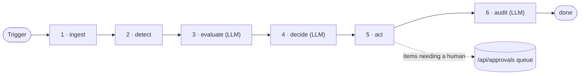
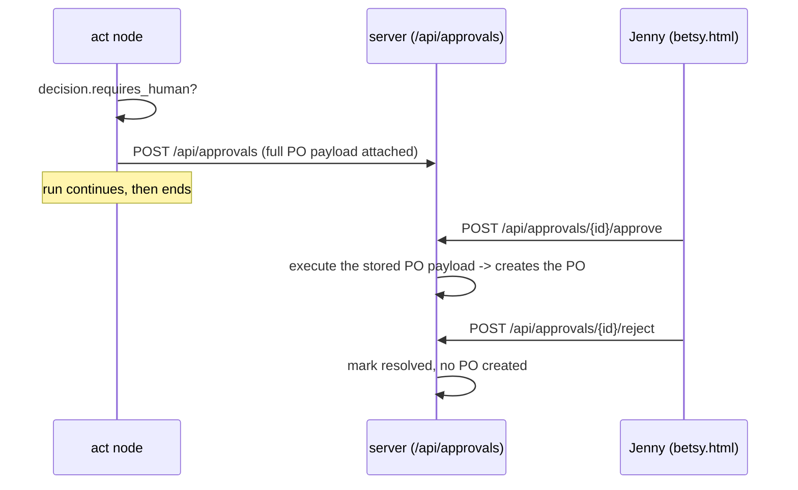
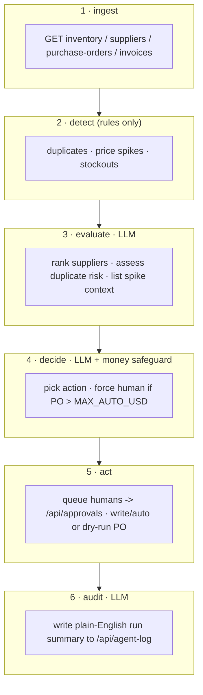

# Betsy — Pipeline Architecture

> **Linear · Sequential · Single-threaded · Audit-first**
> The pipeline is the simpler of Betsy's two agent designs. It walks one
> procurement run through six fixed stages, in order, with no branching: pull the
> data, find every problem, weigh the options, decide, act, and write down what
> happened. It is built as a **LangGraph `StateGraph`** — a small graph whose
> nodes each read and update one shared state object. LLM calls (local Ollama)
> handle the judgement-heavy steps; every LLM call has a rule-based fallback so
> the run still completes if the model is unreachable.

---

## Overview

A single run flows straight through six nodes. There is no skipping, no
reordering, and no early exit — even when something fails, the run still reaches
the final `audit` node so that every attempt leaves a record behind.



Each node receives the shared `PipelineState`, does its one job, and returns the
fields it changed. Because the graph is linear, the order in the diagram is also
the exact order of execution — there are no conditional edges to trace.

---

## Entry point — `pipeline/run.py`

`run.py` is how a run is started, either by a person from the command line or by
the scheduler/server. It builds the compiled graph once, hands it a fresh empty
state, and calls `graph.invoke(...)`. There is no `approval_mode` flag and no
approval object passed in here — approvals are handled later, out of band,
through the API queue (see *How human approval works*).

```
run_full(scenario: str | None = None) -> dict
  - if a scenario name is given, POST it to the mock API first (then reset after)
  - graph = build()                      # pipeline/graph.py
  - final = graph.invoke(initial_state)  # runs all six nodes in order
  - returns the final PipelineState dict
```

Command-line shapes (`python -m pipeline.run`):

| Command | What it does |
|---|---|
| `python -m pipeline.run` | Full six-node run against the live API on :8000 |
| `python -m pipeline.run --scenario stockout_warning` | Inject a scenario, run, then reset |
| `python -m pipeline.run --stage detect` | Run one node in isolation for debugging (delegates to that node module's `__main__`) |

The valid scenario names are `stockout_warning`, `price_spike`,
`duplicate_invoice`, and `supplier_oos`. If the API is not reachable, `run.py`
stops early with a clear message telling you how to start the server.

---

## Shared state — `PipelineState` (`pipeline/state.py`)

Every node reads from and writes to one `TypedDict`. There is no separate
`PipelineContext` class and no nested dataclasses — it is a flat dictionary of
lists that grows as the run progresses. Each node only fills the fields that are
its responsibility, which keeps the data flow easy to follow.

```
PipelineState (TypedDict)
├── ingest fills:    inventory[] · suppliers[] · all_pos[] · open_pos[] · invoices[]
├── detect fills:    detected[]    # DetectedCondition dicts
├── evaluate fills:  evaluated[]   # EvaluatedItem dicts
├── decide fills:    decisions[]   # Decision dicts
├── act fills:       actions[]     # ActionResult dicts
├── audit fills:     report        # plain-English run summary
└── any node may append:  errors[] # uses an operator.add reducer, so node
                                   # errors accumulate instead of overwriting
```

The shapes referenced above (`DetectedCondition`, `EvaluatedItem`, `Decision`,
`ActionResult`) are plain dicts, not classes — their keys are described in each
stage below.

---

## Stage 1 — Ingest (`pipeline/nodes/ingest.py`)

**Job:** fetch everything the run needs in one pass, so no later node has to make
its own API calls. This keeps all I/O in one place and makes the rest of the
pipeline pure data-processing.

```
node(state) -> dict
  GET /api/inventory          -> inventory[]   (12 SKUs)
  GET /api/suppliers          -> suppliers[]   (6 suppliers)
  GET /api/purchase-orders    -> all_pos[]      (full PO history)
                                 open_pos[]     (everything not delivered/cancelled)
  GET /api/invoices           -> invoices[]
```

`open_pos` is just `all_pos` with delivered and cancelled orders filtered out —
later stages use it to avoid re-ordering something that is already on its way.
**LLM:** none. **On failure:** the node catches the exception and appends a
message to `errors[]`; the run continues to the next node rather than crashing.

---

## Stage 2 — Detect (`pipeline/nodes/detect.py`)

**Job:** find *all* anomalies in the ingested data before any of them are acted
on. This stage is deliberately rule-based and LLM-free, so detection is fast,
deterministic, and easy to test. It collects every condition it finds; it never
stops at the first one.

Three detectors run, and their results are concatenated into `detected[]`:

- **`_detect_duplicates(invoices)`** — compares every pair of invoices; flags a
  pair as `duplicate_invoice` when they share the same supplier, the same amount
  (within a cent), and are **within 60 days** of each other. Each detector pair
  is recorded once.
- **`_detect_price_spikes(inventory, all_pos, suppliers)`** — for each SKU it
  builds a **historical baseline from past purchase-order prices** (the mean of
  that SKU's `unit_price` across `all_pos`), then compares it to the best current
  quote among available suppliers. It flags `price_spike` when the best quote is
  more than **30% above** that baseline (`PRICE_SPIKE_THRESHOLD = 0.30`).
- **`_detect_stockouts(inventory)`** — flags any SKU whose `current_stock` is
  below its `reorder_point`. It also computes `days_remaining = current_stock /
  daily_usage_avg` and marks the condition **critical** when that is under 2 days,
  otherwise **warning**.

**LLM:** none. **Output:** `detected[]` — possibly empty, which is a perfectly
valid result meaning "nothing is wrong right now."

---

## Stage 3 — Evaluate (`pipeline/nodes/evaluate.py`) · LLM

**Job:** turn each detected condition into a scored, explained recommendation.
This is the first stage that reasons rather than just measures, so it is also the
first to call the LLM — always with a rule-based fallback behind it.

- **Stockout** → `_evaluate_stockout`. It keeps only suppliers that are available
  and actually carry the SKU, then ranks them by a simple score:
  `reliability_score / lead_days` (a supplier that is both reliable and fast wins).
  It then asks the LLM to pick the best option and explain the trade-off in plain
  language. If the LLM is unreachable, the top-ranked supplier wins automatically
  and the reasoning is marked as a rule-based fallback. Result action:
  `generate_po`.
- **Price spike** → `_evaluate_price_spike`. No LLM is used here on purpose:
  price spikes always go to a human, so confidence is hard-set to `0.0` and the
  suppliers are simply listed cheapest-first as context for the reviewer. Result
  action: `flag_for_approval`.
- **Duplicate invoice** → `_evaluate_duplicate`. The LLM is asked whether the pair
  looks like an innocent billing error or possible fraud. The fallback rule, if
  the model is down, is "≤30 days apart = HIGH risk, otherwise MEDIUM." Result
  action: `flag_duplicate`.

**Output:** `evaluated[]` — one item per condition, each carrying the original
condition, the chosen action, ranked suppliers, a confidence number, and the
reasoning text.

---

## Stage 4 — Decide (`pipeline/nodes/decide.py`) · LLM

**Job:** commit each evaluated item to a concrete decision and, crucially,
enforce the money safeguard that the LLM is not allowed to talk its way around.

The financial limit is a single environment-tunable constant:

```
MAX_AUTO_USD = float(os.getenv("MAX_AUTO_USD", "5000"))   # one-PO auto-approve ceiling
```

There is no separate daily/aggregate cap in the code — the only ceiling is this
per-PO limit. The decision logic is:

- **Duplicate invoice** → `flag_duplicate`, `requires_human = True`. No LLM call.
- **Price spike** → `flag_for_approval`, `requires_human = True`, confidence `0.0`.
  No LLM call.
- **No available supplier** → `escalate`, `requires_human = True`.
- **Stockout with a supplier** → the LLM is asked for an action, confidence, and
  reasoning. Then the safeguard is applied on top of whatever the LLM said:
  **if the PO total exceeds `MAX_AUTO_USD`, `requires_human` is forced to `True`
  and cannot be overridden.** If the LLM is unreachable, a rule-based fallback
  still produces a `generate_po` decision and applies the same money check.

So `auto_approved` is only ever `True` for a stockout PO that comes in under the
limit; everything else is routed to a human. **Output:** `decisions[]`.

---

## Stage 5 — Act (`pipeline/nodes/act.py`)

**Job:** carry out the decisions. Anything that needs a human is parked in the
approval queue with its paperwork already filled in; anything auto-approved is
executed (or simulated, in dry-run mode).

```
node(state) -> dict, for each decision:

  not auto_approved
    -> _queue_for_approval(decision)         # POST /api/approvals
       The full PO payload is pre-built and stored on the queue item now, so the
       later "approve" click can execute it directly with no second LLM call.
       status: "pending_human_review"

  auto_approved + generate_po
    -> if DRY_RUN (default true): status "dry_run", nothing is written
       else: POST /api/purchase-orders via api._post_purchase_order(payload)

  flag_duplicate / flag_for_approval / escalate
    -> status "logged" (the flag itself lives in the audit log; no PO is written)
```

`DRY_RUN` is read from the environment (`DRY_RUN`, default `"true"`), so by
default a run never writes a real purchase order — you opt in to live writes by
setting `DRY_RUN=false`. **LLM:** none. **Output:** `actions[]`.

---

## How human approval works

This is the part most worth being precise about, because there is **no
`ApprovalGate` class and no `shared/approvals.py`** — those do not exist. Human
approval is not a blocking step inside the graph at all. Instead, the `act` node
drops items that need a human onto the `/api/approvals` queue and the run
finishes. A person reviews and resolves them later, asynchronously, through the
API (which `betsy.html` drives with its approve/decline buttons).



Because the payload is stored at queue time, approving is a direct execution of
known data — the agent does not re-reason or re-price on approval, which keeps
the human's decision and the eventual action perfectly in sync. The
approve/reject endpoints and the deferred execution live in
`server/routers/approvals.py`.

---

## Error handling (there is no `PipelineHalt`)

The original design described a `PipelineHalt` exception that short-circuited to
audit. That does not exist in the code. The real mechanism is simpler: **every
node wraps its work in `try/except`, and on failure appends a short message to
`state["errors"]` and returns empty output for its stage.** The graph then
proceeds to the next node as normal. Because the edges are fixed and linear, a
failure early on simply means later stages have less to work with — but the run
always reaches `audit`, so even a broken run is recorded.

---

## Full data flow



---

## Stage 6 — Audit (`pipeline/nodes/audit.py`) · LLM

**Job:** leave a readable record of the whole run. This node always runs (it is
the last node on the only path), so every run — clean, flagged, or partly failed
— ends with one log entry that a non-technical reader can understand.

```
node(state) -> dict
  - build short summaries of conditions, decisions, and actions
  - call_text(...) -> a 2-3 sentence plain-English narrative (LLM)
  - api.log_decision(trigger="pipeline_run", analysis=..., decision=...,
                     confidence=avg(decision confidences),
                     metadata={conditions, decisions, actions, narrative})
  - returns { report: narrative }
```

It writes **one** consolidated entry per run via `api.log_decision(...)`; it does
not write a separate entry per pending decision. If the LLM is unreachable,
`call_text` returns a clearly-marked placeholder string and the structured
metadata is still logged, so nothing is lost.

---

## LLM integration summary

All LLM calls go through `shared/llm.py` at `temperature=0.1` (near-deterministic).
`call_json` strips markdown fences and parses JSON, returning `{fallback: True}`
on **any** failure (bad JSON or no connection); `call_text` returns a marked
placeholder string. Every caller checks for the fallback and degrades to a rule.

| Stage | LLM call | What it decides | Rule-based fallback |
|---|---|---|---|
| 3 — Evaluate (stockout) | Best supplier + reasoning | Which supplier to order from and why | Top `reliability / lead_days` score wins |
| 3 — Evaluate (duplicate) | Fraud vs billing error | Risk level + likelihood | ≤30 days apart = HIGH, else MEDIUM |
| 4 — Decide (stockout) | Action + confidence | What to do; human still forced over the money limit | `generate_po`, human if over `MAX_AUTO_USD` |
| 6 — Audit | Run narrative | 2-3 sentence plain-English summary | Marked placeholder; metadata still logged |

---

## Portability

```bash
# Install Ollama: https://ollama.com/download
ollama pull llama3.1:8b

# Defaults (override via env vars, no code changes needed):
#   OLLAMA_BASE_URL = http://localhost:11434
#   OLLAMA_MODEL    = llama3.1:8b
export OLLAMA_MODEL=llama3.1:8b

python -m pipeline.run                       # full run
python -m pipeline.run --scenario stockout_warning
```

`shared/llm.py` uses `langchain_ollama.ChatOllama`. Pointing at a different
Ollama host or model is a matter of changing the two environment variables above.

---

## Test scenario coverage

These are the four injectable scenarios in `scenarios/`. Each ships with an
`expected_agent_action`, so a run can be checked against a known answer.

| Scenario | Detect finds | Evaluate / Decide | Expected action |
|---|---|---|---|
| `stockout_warning` | stockout (critical, SKU-003) | Best supplier ranked; PO total over $5k → human | `generate_po` (held for approval) |
| `price_spike` | price_spike on SKU-003 | confidence 0.0, always human | `flag_for_approval` |
| `duplicate_invoice` | duplicate invoice pair(s) | LLM assesses fraud likelihood, always human | `flag_duplicate` |
| `supplier_oos` | stockout (SKU-003); the OOS supplier is excluded | next-best available supplier chosen | `generate_po` |

> **Note for maintainers:** the `price_spike` scenario describes its best quote
> ($13.60) as "50% above" the ~$11.40 historical average, but $13.60 / $11.40 is
> only **+19.3%** — which is *below* the code's 30% `PRICE_SPIKE_THRESHOLD`, and
> `detect` actually computes its baseline from PO history rather than the stated
> $11.40. Whether this scenario trips detection therefore depends on the seeded PO
> prices. This threshold-vs-scenario mismatch is worth reconciling (lower the
> threshold, or raise the scenario's quotes) so the expected `flag_for_approval`
> is guaranteed.

---

## Why this design exists (link to the GAP analysis)

The whole point of this sequential loop maps directly onto the before→after story
in the GAP analysis (`bpm_analysis.html` / `docs/gap-analysis.md`): the AS-IS
model is Jenny doing detect → source → approve → order → reconcile by hand over
2–3 days; the pipeline collapses that same chain into one automated pass, while
the money safeguard and the approval queue preserve the one human checkpoint the
GAP's TO-BE model keeps for high-value and anomalous decisions.
